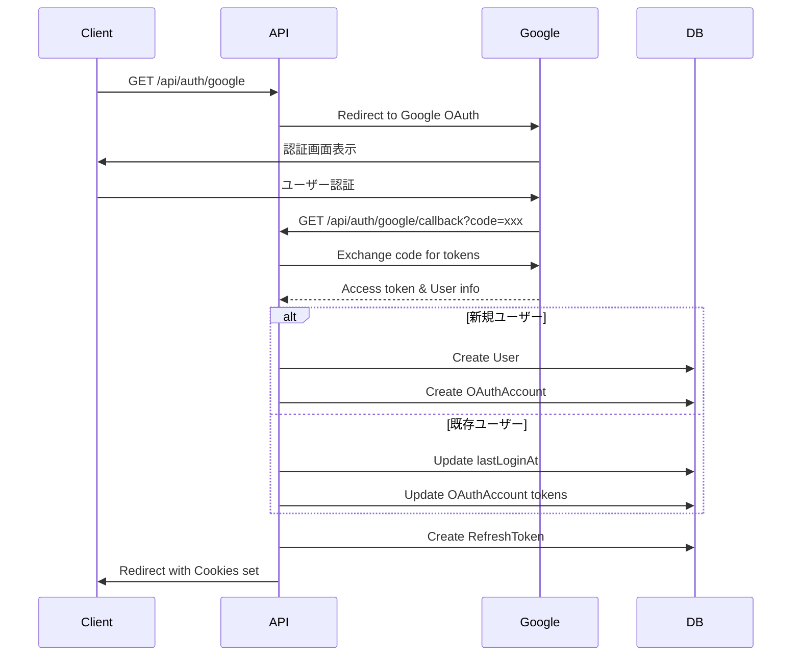
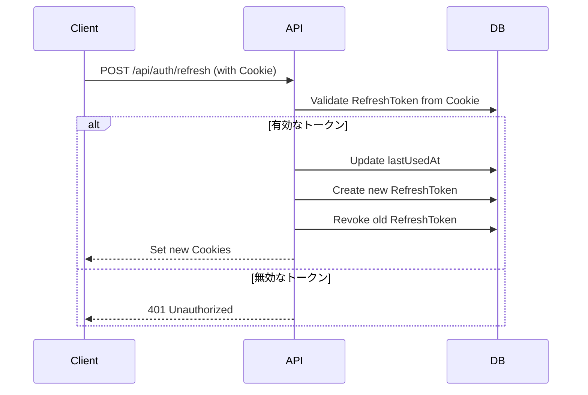

# ユーザー登録・認証API設計書

## 概要
Google OAuth 2.0を使用したユーザー登録・認証システムの設計書。  
Nest.js、Prisma、Passport、JWTを使用して実装する。

## アーキテクチャ

### 技術スタック
- **Framework**: Nest.js
- **ORM**: Prisma
- **認証**: Passport (Google OAuth 2.0)
- **トークン管理**: JWT (Access Token + Refresh Token)
- **DB**: PostgreSQL

### フォルダ構成
```
src/
├── auth/                       # 認証関連モジュール
│   ├── auth.module.ts
│   ├── auth.service.ts
│   ├── auth.controller.ts
│   ├── decorators/
│   │   ├── current-user.decorator.ts
│   │   └── public.decorator.ts
│   ├── dto/
│   │   ├── auth-response.dto.ts
│   │   └── refresh-token.dto.ts
│   ├── guards/
│   │   ├── google-oauth.guard.ts
│   │   ├── jwt-auth.guard.ts
│   │   └── refresh-token.guard.ts
│   ├── strategies/
│   │   ├── google.strategy.ts
│   │   ├── jwt.strategy.ts
│   │   └── refresh-token.strategy.ts
│   └── interfaces/
│       ├── jwt-payload.interface.ts
│       └── google-user.interface.ts
├── users/                      # ユーザー管理モジュール
│   ├── users.module.ts
│   ├── users.service.ts
│   ├── users.controller.ts
│   └── dto/
│       ├── create-user.dto.ts
│       └── update-user.dto.ts
├── common/                     # 共通モジュール
│   └── decorators/
│       ├── current-user.decorator.ts
│       └── public.decorator.ts
└── prisma/                     # Prismaサービス
    ├── prisma.module.ts
    └── prisma.service.ts
```

## APIエンドポイント

### 認証関連

#### 1. Google OAuth認証開始
```
GET /api/auth/google
```
- Google OAuth認証フローを開始
- Google認証画面にリダイレクト

#### 2. Google OAuth コールバック
```
GET /api/auth/google/callback
```
- Googleからのコールバックを処理
- 成功時: JWTトークンを生成してフロントエンドにリダイレクト
- Query Parameters:
  - `code`: 認証コード
  - `state`: CSRF対策用のstate

#### 3. トークンリフレッシュ
```
POST /api/auth/refresh
```
- Cookie: `refreshToken` (httpOnly, secure, sameSite=strict)
- Response: 
  - 新しいトークンをCookieにセット
  - Body:
    ```json
    {
      "success": true,
      "expiresIn": 3600
    }
    ```

#### 4. ログアウト
```
POST /api/auth/logout
```
- Cookie: `accessToken`, `refreshToken` (httpOnly cookies)
- リフレッシュトークンを無効化
- Cookieをクリア

### ユーザー情報関連

#### 5. 現在のユーザー情報取得
```
GET /api/users/me
```
- Cookie: `accessToken` (httpOnly, secure, sameSite=strict)
- Response:
  ```json
  {
    "id": "string",
    "email": "string",
    "name": "string",
    "profileImageUrl": "string",
    "createdAt": "2024-01-01T00:00:00Z"
  }
  ```

#### 6. ユーザー情報更新
```
PATCH /api/users/me
```
- Cookie: `accessToken` (httpOnly, secure, sameSite=strict)
- Request Body:
  ```json
  {
    "name": "string",
    "profileImageUrl": "string"
  }
  ```

## 認証フロー

### 1. 初回登録・ログインフロー


### 2. トークンリフレッシュフロー


## セキュリティ考慮事項

### 1. JWT設計
- **Access Token**
  - 有効期限: 15分
  - ペイロード:
    ```typescript
    {
      sub: string;      // userId
      email: string;
      iat: number;
      exp: number;
    }
    ```

- **Refresh Token**
  - 有効期限: 7日間
  - DBにハッシュ化して保存
  - 1回使用で新しいトークンに置き換え（Rotation）

### 2. セキュリティ対策
- HTTPS必須
- CORS設定で許可されたオリジンのみアクセス可能（credentials: true）
- AccessToken、RefreshTokenともに`httpOnly`、`secure`、`sameSite=strict`のCookieで送信
- Cookie設定:
  ```typescript
  // Access Token Cookie
  {
    httpOnly: true,
    secure: true, // production環境
    sameSite: 'strict',
    maxAge: 15 * 60 * 1000, // 15分
    path: '/'
  }
  
  // Refresh Token Cookie
  {
    httpOnly: true,
    secure: true, // production環境
    sameSite: 'strict',
    maxAge: 7 * 24 * 60 * 60 * 1000, // 7日
    path: '/api/auth/refresh'
  }
  ```

### 3. エラーハンドリング
- 統一されたエラーレスポンス形式
- センシティブな情報を含まないエラーメッセージ

## 実装の詳細

### 1. Cookie Parser設定
```typescript
// main.ts
import * as cookieParser from 'cookie-parser';

async function bootstrap() {
  const app = await NestFactory.create(AppModule);
  app.use(cookieParser());
  app.enableCors({
    origin: process.env.FRONTEND_URL,
    credentials: true,
  });
  // ...
}
```

### 2. Google Strategy設定
```typescript
// auth/strategies/google.strategy.ts
@Injectable()
export class GoogleStrategy extends PassportStrategy(Strategy, 'google') {
  constructor(
    private authService: AuthService,
    private configService: ConfigService,
  ) {
    super({
      clientID: configService.get('GOOGLE_CLIENT_ID'),
      clientSecret: configService.get('GOOGLE_CLIENT_SECRET'),
      callbackURL: configService.get('GOOGLE_CALLBACK_URL'),
      scope: ['email', 'profile'],
    });
  }

  async validate(
    accessToken: string,
    refreshToken: string,
    profile: any,
  ): Promise<any> {
    return this.authService.validateGoogleUser(profile, accessToken, refreshToken);
  }
}
```

### 3. JWT Strategy (Cookie用)
```typescript
// auth/strategies/jwt.strategy.ts
@Injectable()
export class JwtStrategy extends PassportStrategy(Strategy, 'jwt') {
  constructor(private configService: ConfigService) {
    super({
      jwtFromRequest: ExtractJwt.fromExtractors([
        (request: Request) => {
          return request?.cookies?.accessToken;
        },
      ]),
      ignoreExpiration: false,
      secretOrKey: configService.get('JWT_ACCESS_SECRET'),
    });
  }

  async validate(payload: any) {
    return { userId: payload.sub, email: payload.email };
  }
}
```

### 4. JWT Guard実装
```typescript
// auth/guards/jwt-auth.guard.ts
@Injectable()
export class JwtAuthGuard extends AuthGuard('jwt') {
  constructor(private reflector: Reflector) {
    super();
  }

  canActivate(context: ExecutionContext) {
    const isPublic = this.reflector.getAllAndOverride<boolean>(IS_PUBLIC_KEY, [
      context.getHandler(),
      context.getClass(),
    ]);
    if (isPublic) {
      return true;
    }
    return super.canActivate(context);
  }
}
```

### 5. AuthService主要メソッド
- `validateGoogleUser`: Googleユーザー情報の検証と登録/更新
- `generateTokens`: JWT tokens生成とCookie設定
- `refreshTokens`: トークンリフレッシュ処理
- `logout`: ログアウト処理（RefreshToken無効化、Cookieクリア）
- `setTokenCookies`: レスポンスにCookieを設定

## 環境変数
```env
# Google OAuth
GOOGLE_CLIENT_ID=
GOOGLE_CLIENT_SECRET=
GOOGLE_CALLBACK_URL=http://localhost:3000/api/auth/google/callback

# JWT
JWT_ACCESS_SECRET=
JWT_ACCESS_EXPIRATION=15m
JWT_REFRESH_SECRET=
JWT_REFRESH_EXPIRATION=7d

# Frontend
FRONTEND_URL=http://localhost:3001
```


## 実装TODO

### 1. 必要なパッケージのインストール
```bash
pnpm add @nestjs/passport passport passport-google-oauth20 @nestjs/jwt passport-jwt cookie-parser bcrypt
pnpm add -D @types/passport @types/passport-google-oauth20 @types/passport-jwt @types/cookie-parser @types/bcrypt
```

### 2. 実装順序
1. **Prismaセットアップ**
   - [x] prisma.module.ts作成
   - [x] prisma.service.ts作成
   - [x] Prisma migrateの実行

2. **共通モジュール**
   - [] common/decorators/public.decorator.ts
   - [] common/decorators/current-user.decorator.ts

3. **Authモジュール基盤**
   - [] auth.module.ts
   - [] auth.service.ts
   - [] auth.controller.ts
   - [] interfaces/jwt-payload.interface.ts
   - [] interfaces/google-user.interface.ts
   - [] dto/auth-response.dto.ts

4. **Strategies実装**
   - [] strategies/google.strategy.ts
   - [] strategies/jwt.strategy.ts
   - [] strategies/refresh-token.strategy.ts

5. **Guards実装**
   - [] guards/google-oauth.guard.ts
   - [] guards/jwt-auth.guard.ts
   - [] guards/refresh-token.guard.ts

6. **Usersモジュール**
   - [] users.module.ts
   - [] users.service.ts
   - [] users.controller.ts
   - [] dto/create-user.dto.ts
   - [] dto/update-user.dto.ts

7. **メインアプリケーション設定**
   - [] main.tsにCookie Parser追加
   - [] main.tsにCORS設定追加
   - [] app.moduleにグローバルガード設定

