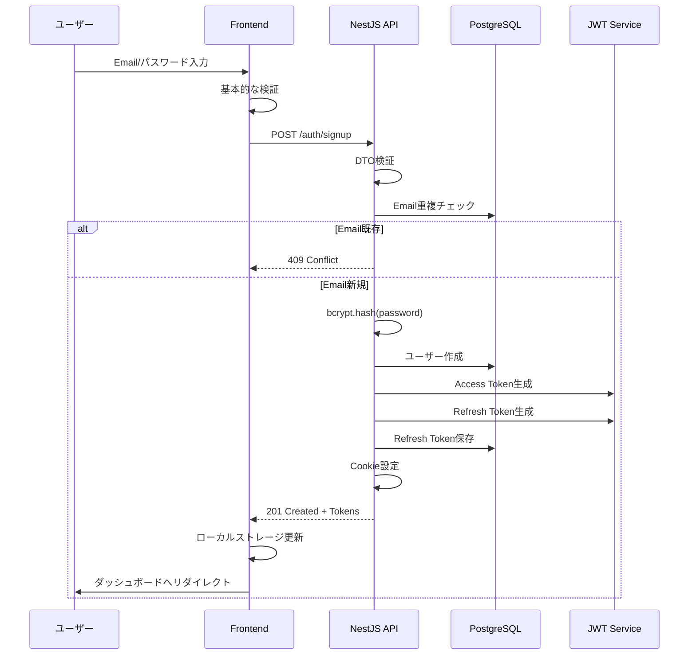

# サインアップ機能実装計画書

## 概要
シンプルなJWT + Email/パスワード方式によるユーザー登録機能を実装します。
NextAuth.jsは使用せず、Nest.js APIで認証ロジックを実装し、Next.jsフロントエンドと連携します。

## 認証ストラテジーの選択理由

### なぜpassport-localが不要なのか？
1. **JWTベースの認証システム**
   - passport-localは主にセッションベース認証で使用される
   - 今回はJWTトークンベースの認証を採用
   - ログイン時の認証ロジックは独自実装で十分

2. **必要最小限の実装**
   - passport-jwtのみで認証ガードを実装
   - 独自のEmail/パスワード検証ロジック
   - 複雑性を避けシンプルに保つ

3. **将来のOAuth対応を考慮**
   - passport-localに依存しない設計
   - 認証プロバイダーを抽象化しやすい構造
   - プロバイダー別の処理を追加しやすい

## パスワード処理フローの詳細

### 1. サインアップ時のパスワード処理
```
[ユーザー入力] → [フロントエンド検証] → [HTTPS送信] → [API受信]
                                                          ↓
[DB保存] ← [ハッシュ化] ← [ソルト生成] ← [サーバー側検証]
```

#### 詳細ステップ：
1. **フロントエンド検証**
   - 最小8文字
   - 大文字・小文字・数字を含む
   - 一般的な弱いパスワードのチェック

2. **HTTPS送信**
   - 平文パスワードをSSL/TLSで暗号化送信
   - Content-Type: application/json

3. **サーバー側検証**
   - DTOによる入力検証（class-validator）
   - SQLインジェクション対策
   - パスワード強度の再チェック

4. **bcryptによるハッシュ化**
   ```typescript
   const saltRounds = 10; // コスト係数
   const salt = await bcrypt.genSalt(saltRounds);
   const passwordHash = await bcrypt.hash(password, salt);
   ```
   - ソルトは自動生成（ハッシュに含まれる）
   - タイミング攻撃対策（処理時間の一定化）

5. **データベース保存**
   - passwordHashフィールドに保存
   - 平文パスワードは一切保存しない

### 2. セキュリティ考慮事項
- **レート制限**: 同一IPからの大量リクエストを制限
- **アカウントロック**: 連続失敗時の一時的なロック
- **監査ログ**: 認証試行の記録
- **エラーメッセージ**: 攻撃者に情報を与えない汎用的なメッセージ

### 3. bcrypt vs argon2の選択理由
- **bcrypt選択の理由**:
  - 実績があり安定している
  - Node.jsエコシステムでの広範な採用
  - 適切なコスト係数（10-12）で十分なセキュリティ
  - メモリ使用量が予測可能

- **argon2の利点**（将来的な移行も可能）:
  - より新しいアルゴリズム（2015年PHC優勝）
  - メモリハード関数でGPU攻撃に強い
  - パラメータ調整の柔軟性

### 4. タイミング攻撃対策
```typescript
// 悪い例：早期リターンでタイミングが異なる
if (!user) return unauthorized();
if (!await bcrypt.compare(password, user.passwordHash)) return unauthorized();

// 良い例：常に同じ処理時間
const user = await findUser(email);
const dummyHash = '$2b$10$dummyhash...'; // 事前生成のダミーハッシュ
const hashToCompare = user ? user.passwordHash : dummyHash;
const isValid = await bcrypt.compare(password, hashToCompare);
if (!user || !isValid) return unauthorized();
```

## 将来のOAuth対応を考慮した設計

### 1. データベース設計の拡張性
```prisma
// 将来的な拡張例
model User {
  // 既存フィールド...
  passwordHash    String?   // OAuthユーザーはnull可
  authProvider    String    @default("local") // local | google | github
  
  // OAuth連携用
  oauthAccounts   OAuthAccount[]
}

model OAuthAccount {
  id              String    @id @default(cuid())
  userId          String
  provider        String    // google, github, etc
  providerUserId  String
  accessToken     String?
  refreshToken    String?
  
  user            User      @relation(fields: [userId], references: [id])
  
  @@unique([provider, providerUserId])
}
```

### 2. 認証サービスの抽象化
```typescript
// 将来的な実装例
interface AuthProvider {
  validateUser(credentials: any): Promise<User | null>;
  createUser(data: any): Promise<User>;
}

class LocalAuthProvider implements AuthProvider {
  // Email/パスワード認証
}

class GoogleAuthProvider implements AuthProvider {
  // Google OAuth認証
}
```

## アーキテクチャ概要

### 認証フロー
1. **ユーザー登録**
   - フロントエンド → API: Email/パスワードを送信
   - API: 詳細なパスワード検証とハッシュ化
   - API: ユーザー情報をDBに保存
   - API: JWT（Access Token）とRefresh Tokenを生成
   - API → フロントエンド: トークンを返却（HttpOnly Cookie）

### トークン戦略
- **Access Token**: 短命（15分）、ユーザー情報を含むJWT
- **Refresh Token**: 長命（7日）、DBに保存し無効化可能

## 実装ファイル構成

### 新規作成ファイル

#### 1. Prismaサービス
- `src/prisma/prisma.service.ts` - Prisma Clientのラッパーサービス
- `src/prisma/prisma.module.ts` - Prismaモジュール定義

#### 2. 認証モジュール
- `src/auth/auth.module.ts` - 認証モジュール定義
- `src/auth/auth.controller.ts` - 認証エンドポイント（/auth/signup）
- `src/auth/auth.service.ts` - 認証ビジネスロジック

#### 3. DTO（Data Transfer Object）
- `src/auth/dto/signup.dto.ts` - サインアップリクエストの検証
- `src/auth/dto/auth-response.dto.ts` - 認証レスポンスの型定義

#### 4. Guards & Strategies
- `src/auth/guards/jwt-auth.guard.ts` - JWT認証ガード
- `src/auth/strategies/jwt.strategy.ts` - JWT検証戦略

#### 5. インターフェース
- `src/auth/interfaces/jwt-payload.interface.ts` - JWTペイロードの型定義
- `src/auth/interfaces/tokens.interface.ts` - トークンの型定義

#### 6. 設定
- `src/config/jwt.config.ts` - JWT設定（秘密鍵、有効期限等）

### 変更ファイル

#### 1. メインモジュール
- `src/app.module.ts` - AuthModuleとPrismaModuleをインポート

#### 2. 環境設定
- `.env` - JWT_SECRET、JWT_REFRESH_SECRET等の環境変数を追加

#### 3. メインファイル
- `src/main.ts` - ValidationPipeの設定、CORSの設定

## サインアップシーケンスダイアグラム



## エラーハンドリング詳細

### 1. 入力検証エラー
```typescript
// 400 Bad Request
{
  "statusCode": 400,
  "message": [
    "email must be an email",
    "password must be longer than or equal to 8 characters"
  ],
  "error": "Bad Request"
}
```

### 2. Email重複エラー
```typescript
// 409 Conflict（セキュリティ上、詳細は隠す）
{
  "statusCode": 409,
  "message": "User registration failed",
  "error": "Conflict"
}
```

### 3. サーバーエラー
```typescript
// 500 Internal Server Error
{
  "statusCode": 500,
  "message": "An error occurred during registration",
  "error": "Internal Server Error"
}
```

## 実装詳細

### 1. Prismaサービス
```typescript
// src/prisma/prisma.service.ts
- PrismaClientを拡張
- 接続管理
- グローバルプロバイダーとして登録
```

### 2. 認証サービス
```typescript
// src/auth/auth.service.ts
主要メソッド:
- signup(email, password): ユーザー登録
- hashPassword(password): パスワードハッシュ化
- generateTokens(userId): JWT生成
- saveRefreshToken(userId, token): リフレッシュトークン保存
```

### 3. 認証コントローラー
```typescript
// src/auth/auth.controller.ts
エンドポイント:
- POST /auth/signup
  - リクエスト: { email, password }
  - レスポンス: { user, accessToken, refreshToken }
  - Cookie設定: HttpOnly, Secure, SameSite
```

### 4. DTO検証
```typescript
// src/auth/dto/signup.dto.ts
export class SignupDto {
  @IsEmail({}, { message: 'Invalid email format' })
  @Transform(({ value }) => value.toLowerCase())
  email: string;

  @IsString()
  @MinLength(8)
  @Matches(
    /^(?=.*[a-z])(?=.*[A-Z])(?=.*\d)[a-zA-Z\d@$!%*?&]{8,}$/,
    {
      message: 'Password must contain at least one uppercase letter, one lowercase letter, and one number',
    },
  )
  password: string;

  @IsString()
  @IsOptional()
  @MinLength(2)
  @MaxLength(50)
  name?: string;
}
```

### 5. セキュリティ考慮事項
- パスワードは必ずハッシュ化（bcrypt使用）
- JWTの秘密鍵は環境変数で管理
- リフレッシュトークンはハッシュ化してDBに保存
- HttpOnly Cookieでトークンを管理
- CORS設定で許可されたオリジンのみアクセス可能

## 必要な依存関係

### 既にインストール済み
- `@nestjs/jwt`: JWT生成・検証
- `@nestjs/passport`: Passportとの統合

### 追加でインストールが必要
```bash
npm install bcrypt class-validator class-transformer passport passport-jwt cookie-parser
npm install -D @types/bcrypt @types/passport-jwt @types/cookie-parser
```

### 各パッケージの役割
- **bcrypt**: パスワードのハッシュ化
- **class-validator**: DTO検証
- **class-transformer**: リクエストボディの変換
- **passport & passport-jwt**: JWT認証ストラテジー（passport-localは使用しない）
- **cookie-parser**: HttpOnly Cookieの処理

## 環境変数
```env
# JWT設定
JWT_SECRET=your-super-secret-jwt-key
JWT_REFRESH_SECRET=your-super-secret-refresh-key
JWT_EXPIRATION=15m
JWT_REFRESH_EXPIRATION=7d

# アプリケーション設定
FRONTEND_URL=http://localhost:3000
```

## テスト計画
1. ユニットテスト
   - AuthServiceのメソッドテスト
   - パスワードハッシュ化のテスト
   - JWT生成・検証のテスト

2. 統合テスト
   - サインアップエンドポイントのテスト
   - 不正なリクエストの検証テスト
   - トークン発行の確認

## 実装順序
1. 必要なパッケージのインストール
2. Prismaサービスの実装
3. JWT設定の実装
4. DTOの作成
5. 認証サービスの実装
6. 認証コントローラーの実装
7. ガードとストラテジーの実装
8. モジュールの統合
9. テストの実装

## フロントエンドとの連携

### 1. リクエスト例（Next.js）
```typescript
const response = await fetch('http://localhost:3300/auth/signup', {
  method: 'POST',
  headers: {
    'Content-Type': 'application/json',
  },
  credentials: 'include', // Cookie送信に必要
  body: JSON.stringify({
    email: 'user@example.com',
    password: 'StrongP@ss123',
    name: 'John Doe'
  }),
});
```

### 2. Cookie設定詳細
```typescript
// src/auth/auth.controller.ts
response.cookie('access_token', accessToken, {
  httpOnly: true,
  secure: process.env.NODE_ENV === 'production',
  sameSite: 'strict',
  maxAge: 15 * 60 * 1000, // 15分
});

response.cookie('refresh_token', refreshToken, {
  httpOnly: true,
  secure: process.env.NODE_ENV === 'production',
  sameSite: 'strict',
  maxAge: 7 * 24 * 60 * 60 * 1000, // 7日
  path: '/auth/refresh', // リフレッシュエンドポイントのみ
});
```

### 3. CORS設定
```typescript
// src/main.ts
app.enableCors({
  origin: process.env.FRONTEND_URL || 'http://localhost:3000',
  credentials: true,
  methods: ['GET', 'POST', 'PUT', 'DELETE', 'PATCH'],
  allowedHeaders: ['Content-Type', 'Authorization'],
});
```

## 次のステップ（ログイン機能）
この実装が完了後、以下のログイン機能を追加：
- POST /auth/login エンドポイント
- POST /auth/refresh リフレッシュトークン更新
- POST /auth/logout ログアウト（リフレッシュトークンの無効化）
- GET /auth/me 現在のユーザー情報取得